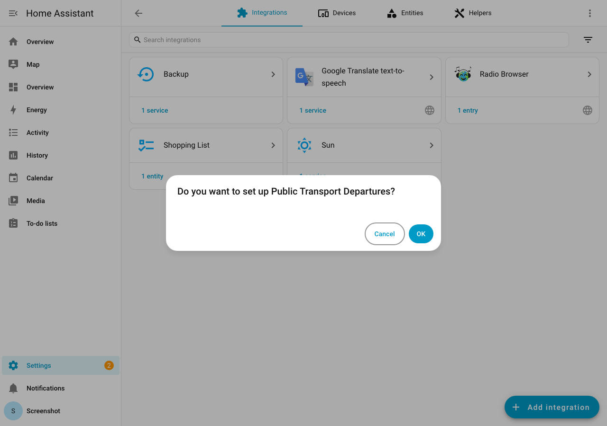
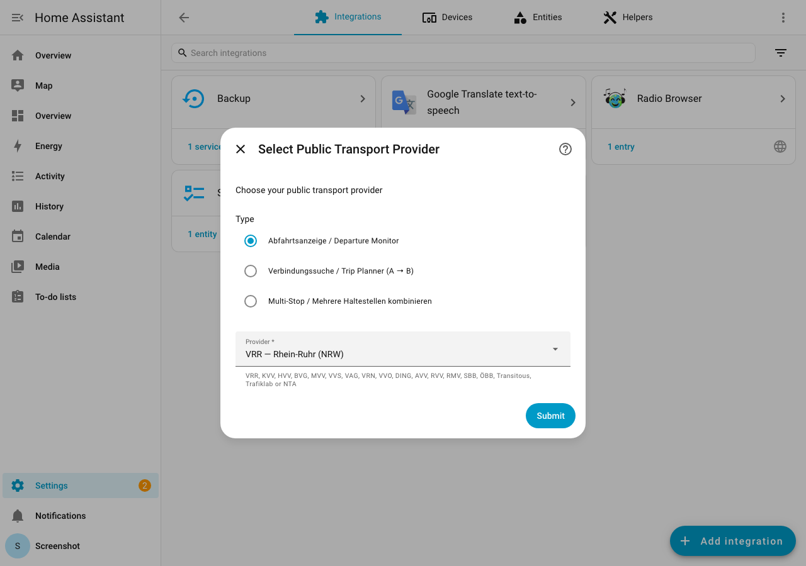
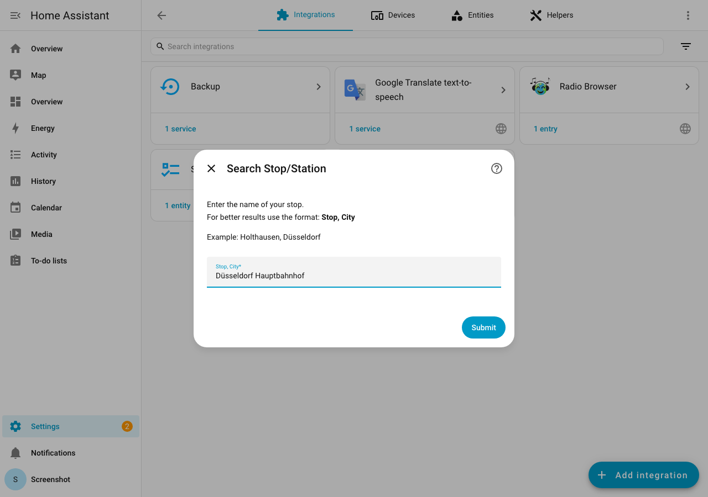
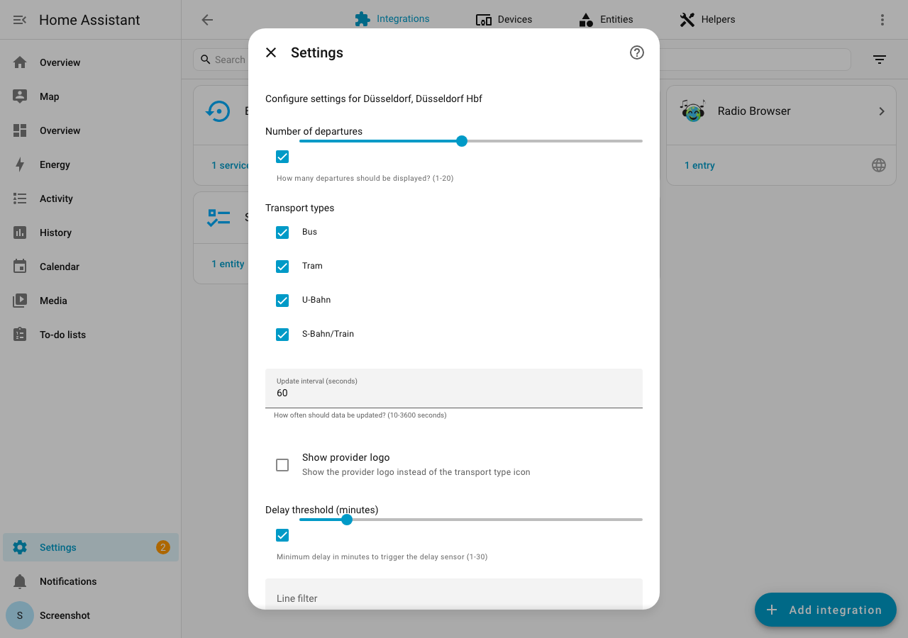
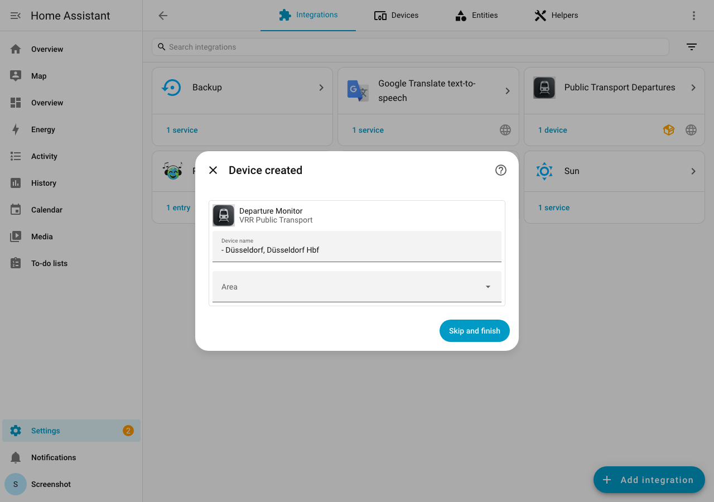
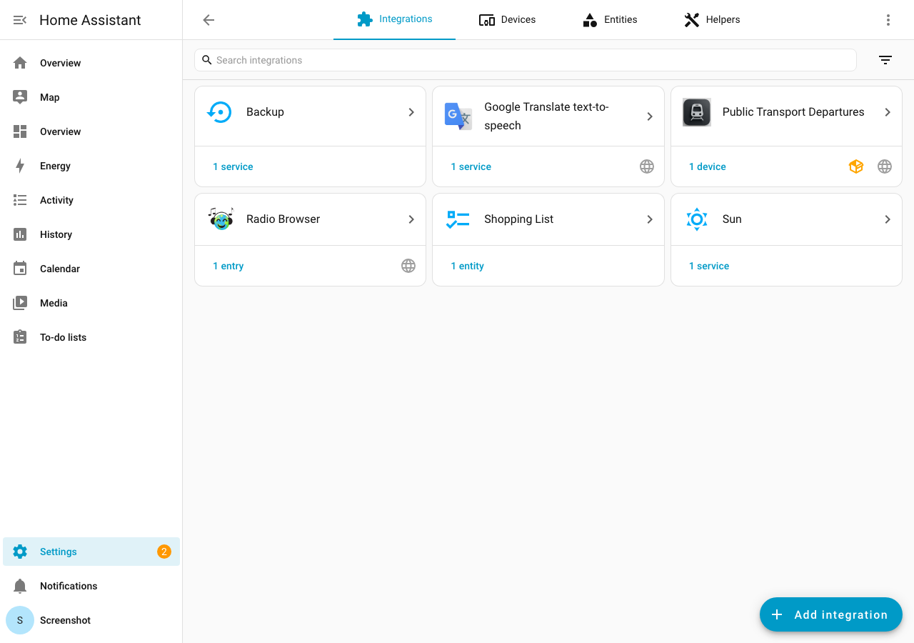

# Configuration

The integration uses an intuitive multi-step setup wizard with autocomplete functionality.

## Setup Wizard

When you add the integration, you'll first see a confirmation dialog:

Click **OK** to start the setup wizard.

### Step 1: Select Provider

Choose your transit provider from the descriptive dropdown. Each entry shows the provider's full name and region (e.g. "VRR — Rhein-Ruhr (NRW)" instead of just "vrr"). You can also select the entry type: **Departure Monitor**, **Trip Planner**, or **Multi-Stop**.

All 23 providers are available — see the [full provider list](providers/index.md) for details.

!!! note
    Most providers require no API key. Trafiklab (Sweden), NTA (Ireland), and RMV (Frankfurt) require a free API key — you'll be prompted to enter it in the next step.

### Step 2: API Key (if required)

For **Trafiklab** and **NTA** providers, you'll need to enter your API key.

See the provider-specific documentation for instructions:

- [Trafiklab API Key](providers/trafiklab.md#api-key)
- [NTA API Key](providers/nta.md#api-key)

### Step 3: Search for Stop

Enter your stop/station name. The integration will search and suggest matching stops.

**Tips for better search results:**

- Use the "Stop, City" format for precise results (e.g. "Holthausen, Düsseldorf") — the integration splits this into a stop name and city filter automatically
- You can also enter the city name along with the stop name (e.g., "Düsseldorf Hauptbahnhof")
- The search handles typos and umlaut variations automatically
- For Swedish/Irish stops, use local naming conventions

### Step 4: Select Stop

If multiple stops match your search, you'll be presented with a list to choose from. Each entry shows:

- Stop name
- City/place (in parentheses)

### Step 5: Configure Settings

| Setting | Default | Range | Description |
|---------|---------|-------|-------------|
| **Number of departures** | 10 | 1-20 | How many departures to fetch |
| **Transportation types** | All | Multi-select | Filter by transport type |
| **Scan interval** | 60 | 10-3600 seconds | How often to update |
| **Use provider logo** | Off | On/Off | Show provider logo instead of transport icon |

After completing the settings, the integration will create a device with all entities:

The integration will now appear on your Integrations page:

## Adding Multiple Stops

To monitor multiple stops:

1. Go to **Settings** > **Devices & Services**
2. Find the "Public Transport Departures" integration
3. Click **Add Entry**
4. Follow the setup wizard again

Each stop will create its own sensor and binary sensor entities.

## Modifying Settings

After initial setup, you can modify settings:

1. Go to **Settings** > **Devices & Services**
2. Find your stop entry
3. Click **Configure**
4. Adjust settings as needed

!!! tip
    You can change:

    - Number of departures
    - Transportation type filter
    - Scan interval
    - Provider logo display

## Configuration Options Reference

### Number of Departures

Controls how many upcoming departures are fetched from the API.

- **Minimum**: 1
- **Maximum**: 20
- **Recommended**: 5-10

Higher values provide more information but increase API usage.

### Transportation Types

Filter departures by transport type:

| Type | Description |
|------|-------------|
| `train` | All trains (ICE, IC, RE, RB) |
| `subway` | Subway/Metro (U-Bahn) |
| `tram` | Tram/Streetcar |
| `bus` | All bus types |
| `ferry` | Ferry services |
| `taxi` | Taxi/On-demand |

### Scan Interval

How often the integration fetches new data from the API.

- **Minimum**: 10 seconds
- **Maximum**: 3600 seconds (1 hour)
- **Recommended**: 60-120 seconds

!!! warning
    Setting very low intervals may trigger rate limiting on some providers.

### Use Provider Logo

When enabled, the entity picture shows the provider's logo instead of the dynamic transport type icon.
